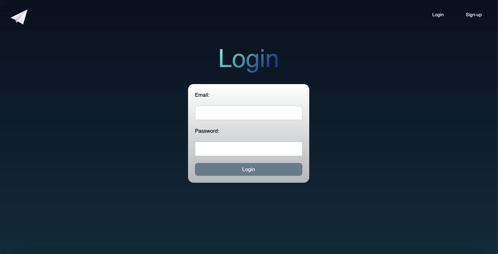
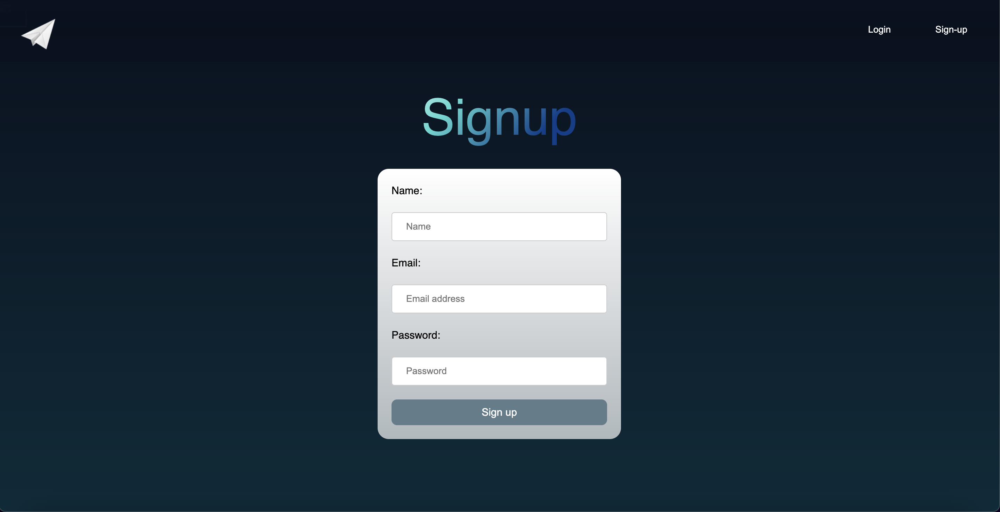
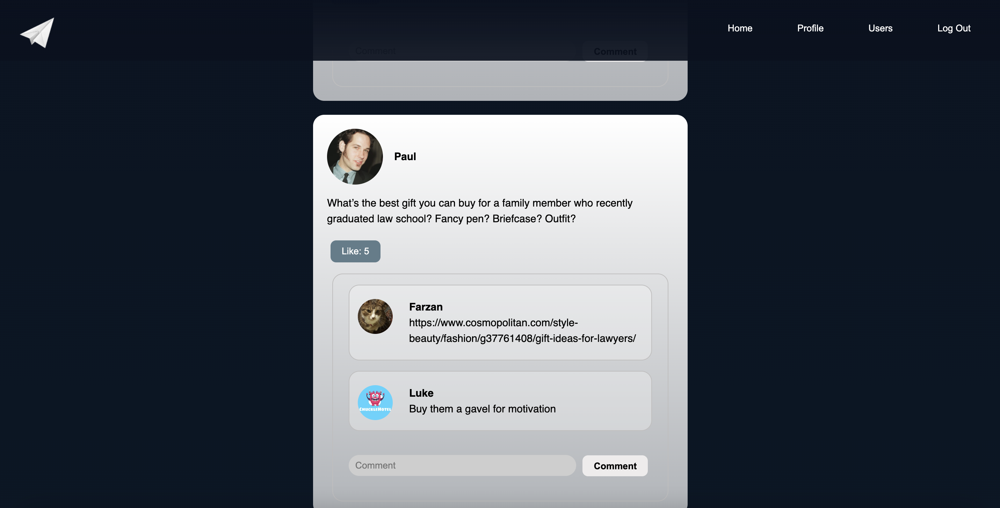
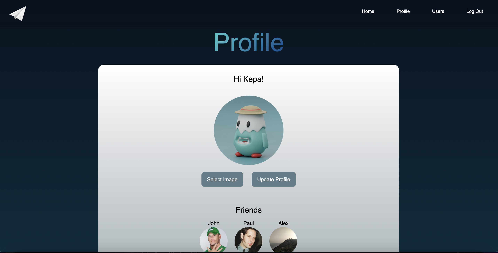

```
 $$$$$$\                      $$\                           $$\       
$$  __$$\                     $$ |                          $$ |      
$$ /  $$ | $$$$$$$\  $$$$$$\  $$$$$$$\   $$$$$$\   $$$$$$\  $$ |  $$\ 
$$$$$$$$ |$$  _____|$$  __$$\ $$  __$$\ $$  __$$\ $$  __$$\ $$ | $$  |
$$  __$$ |$$ /      $$$$$$$$ |$$ |  $$ |$$ /  $$ |$$ /  $$ |$$$$$$  / 
$$ |  $$ |$$ |      $$   ____|$$ |  $$ |$$ |  $$ |$$ |  $$ |$$  _$$<  
$$ |  $$ |\$$$$$$$\ \$$$$$$$\ $$$$$$$  |\$$$$$$  |\$$$$$$  |$$ | \$$\ 
\__|  \__| \_______| \_______|\_______/  \______/  \______/ \__|  \__|
```

# Acebook

| [Contributors](#contributors) | [Project description](#project-description) | [Production](#production) | [Demo](#demo) | [Technologies used](#technologies-used) | [How to run locally](#how-to-run-locally) | [Card wall](#card-wall) | [Team approach](#team-approach) | [User stories](#user-stories) | [Further User Stories](#further-user-stories) | [Minimum Viable Product](#minimum-viable-product-mvp) | [Wireframes](#wireframes) | [Edge cases](#edge-cases) | [Future improvements](#future-improvements) |

### Forked from [Luke Storey](https://github.com/lukestorey95/acebook)
[](https://github.com/lukestorey95/acebook/actions/workflows/test.yml)

## Contributors
- [Alexandros Papagiannis](https://github.com/Alexandros91)
- [Erlantz Ramos Sanchez](https://github.com/ErlantzR)
- [Farzan Imanzadeh](https://github.com/Farzan-I)
- [Laura Voss](https://github.com/laura-voss)
- [Luiza Gretzk](https://github.com/LGretzk)
- [Luke Storey](https://github.com/lukestorey95)
- [Stevie Spiegl](https://github.com/S-Spiegl)

## Project Description
For the penultimate engineering project during Weeks 8 and 9 of the Makers Academy hybrid course, we were tasked with developing a [Facebook](https://en-gb.facebook.com/) clone, known as Acebook. Within a team of 7 developers we developed this version that we're proud to present.

## Production
https://lacebook.herokuapp.com/

## Demo
### Home page


### Login page


### Sign up page


### Timeline



### Profile page


### Users page


## Technologies Used
- [Express](https://expressjs.com/) web framework for Node.js.
- [Nodemon](https://nodemon.io/) to reload the server automatically.
- [Handlebars](https://handlebarsjs.com/) to render view templates.
- [Mongoose](https://mongoosejs.com) to model objects in MongoDB.
- [ESLint](https://eslint.org) for linting.
- [Jest](https://jestjs.io/) for testing.
- [Cypress](https://www.cypress.io/) for end-to-end testing.
- [CSS](https://www.w3.org/Style/CSS/Overview.en.html) for styling of the webpages.

## How to run locally
### Install Node.js

1. Install Node Version Manager (NVM)
   ```
   brew install nvm
   ```
   Then follow the instructions to update your `~/.bash_profile`.
2. Open a new terminal
3. Install the latest version of [Node.js](https://nodejs.org/en/), currently `18.1.0`.
   ```
   nvm install 18
   ```

### Set up this project

1. Fork this repository
2. Rename this fork
3. Clone the fork to your local machine
4. Install Node.js dependencies
   ```
   npm install
   ```
5. Install an ESLint plugin for your editor. For example: [linter-eslint](https://github.com/AtomLinter/linter-eslint) for Atom and installing the `ES Lint` 
6. Install MongoDB
   ```
   brew tap mongodb/brew
   brew install mongodb-community@5.0
   ```
   *Note:* If you see a message that says `If you need to have mongodb-community@5.0 first in your PATH, run:`, follow the instruction. Restart your terminal after this.
7. Start MongoDB
   ```
   brew services start mongodb-community@5.0
   ```

### Start

1. Start the server
   ```
   npm start
   ```
2. Browse to [http://localhost:3000](http://localhost:3000)

#### Start test server
The server must be running locally with test configuration for the
integration tests to pass.

```
npm run start:test
```

This starts the server on port `3030` and uses the `acebook_test` MongoDB database,
so that integration tests do not interact with the development server.

### Test
- Run all tests
  ```
  npm test
  ```
- Run a check
  ```bash
  npm run lint              # linter only
  npm run test:unit         # unit tests only
  npm run test:integration  # integration tests only
  ```
## Card wall
We used a [Trello](https://trello.com/b/jFmua5rj/lukeingforsuggestions) board to keep track of the features we want to implement. We organised tickets amongst the team and moved the tickets accordingly to demonstrate at what stage that feature's at (To do/In progress/In review etc.).

## Team approach
* Standups every morning at 10:00
* Retro at 5:30 every evening
* Pair programming throughotu the whole project
* Regular check-ins with team members to make sure nobody was left behind
* Trello board for distributing work and staying on track

## User stories
### Login
```
As a user,
so that I can join Acebook's vibrant community,
I would like to be able to sign up.
```
```
As a user,
so that I can use Acebook,
I would like to be able to log in.
```
```
As a user, 
so I can choose how other users identify me,
I would like to be able to choose a username to display.
```
### Posts
```
As a user, 
so that I can express myself,
I would like to be able to publish a post.
```
```
As a user, 
so that I know who is posting, 
I would like to see a username attached to each post.
```
```
As a user,
so that I know who is posting,
I would like to see a profile picture attached to each post.
```
```
As a user, 
so that I can share photos, 
I would like to be able to publish photos.
```

### Interactions
```
As a user,
so that I can express how I feel,
I would like to be able to like posts.
```
```
As a user,
so that I can bo gack on what I liked,
I would like to be able to unlike the post.
```
```
As a user,
so that I can express myself,
I would like to be able to comment on posts.
```
```
As a user, 
to interact with other users,
I would like to be able to see who commented on posts.
```

## Further User Stories
```
As a user,
so that I can have friends,
I would like to be able to send friend requests to other users.
```
```
As a user,
so that I can have friends,
I would like to be able to accept friend requests from other users.
```

## Minimum Viable Product (MVP)
* User can sign up, log in and log out
* User can post a post and delete it
* User can see all posts in reverse chronological order

## Wireframes


## Edge cases
* Sign up with invalid input
* Sign up with an already used email
* Sign in with invalid input
* Try to access timeline or profile page when logged out

## Future improvements
* User can see only friends' posts on the timeline
* User can like and respond to individual comments
